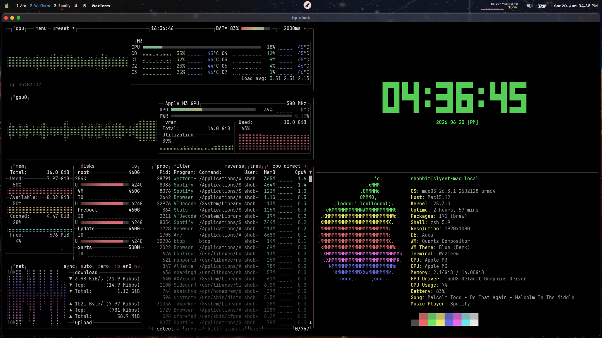
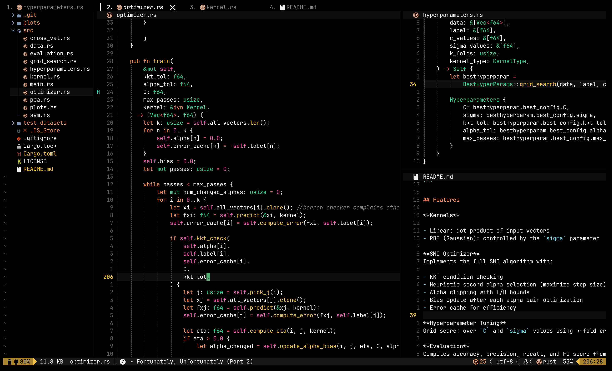
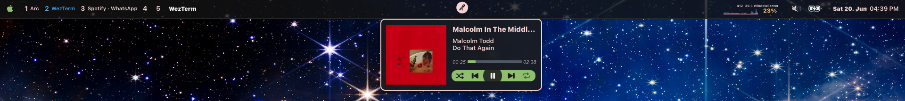

# macOS Dotfiles

> My personal macOS rice setup for a MacBook Air M3.

# Preview

  

  

  

# Setup

## Machine

- **Device:** MacBook Air M3
- **OS:** macOS
- **Shell:** zsh

# Included Configurations

| Tool         | Description              |
| ------------ | ------------------------ |
| `yabai`      | Tiling window manager    |
| `skhd`       | Hotkey daemon            |
| `sketchybar` | Custom status bar        |
| `wezterm`    | GPU accelerated terminal |
| `nvim`       | Neovim setup             |
| `neofetch`   | System info display      |
